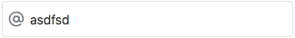

# Text Input element

The text-input widget has two different setups. One has an icon present on the left hand side and the other is a bare text input box.

The component makes use of the two-way data-bind handled using v-model.

```html
<w-text-input :disabled="false" :hasClearButton="true" v-model="textValue">
  <email-icon></email-icon>
</w-text-input>
```

## Examples



```html
<w-text-input :disabled="true" v-model="textValue"></w-text-input>
```


```html
<w-text-input :disabled="false" v-model="textValue">
  <email-icon></email-icon>
</w-text-input>
```


## Default Values
You can set the default value using the v-model binding.
```
*.js
data() {
  return {
    defaultValue: 'This is some rockin text',
  };
},

*.vue
<w-text-input :disabled="false" v-model="defaultValue"></w-text-input>
```

**Do not** pass the text between the elements. This will display in a slot designed for an icon. It will look terrible and isn't actually added to the input elements value.
```
<w-text-input :disabled="false">Don't do this!</w-text-input>
```
